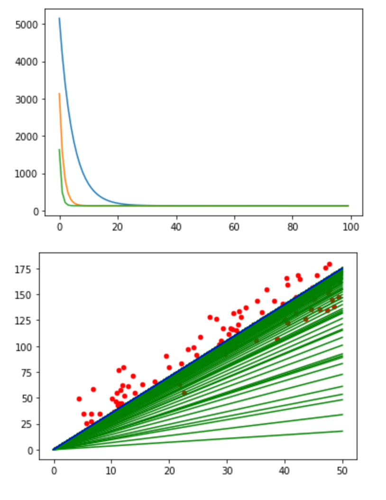

# ML-implementations
###This is a collection of self-implemented ML projects, done with Python and numpy, without using any frameworks (except decision tree classifier)
- **Univariate linear regression**

- **Multivariate linear regression**

- **Logistic regression and bias-variance trade-off**

