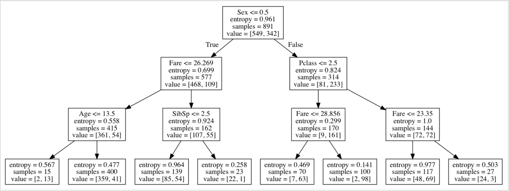

# ML-implementations
## This is a collection of self-implemented ML projects, done with Python and numpy, without using any frameworks (except decision tree classifier)
### - **Univariate linear regression**

### - **Multivariate linear regression with feature scaling**

### - **Logistic regression with and without regularization**

### - **Bias variance trade-off comparison on sin(x)**

### - **Decision trees, entropy and information gain**

Запусти decision tree (skleatn)

